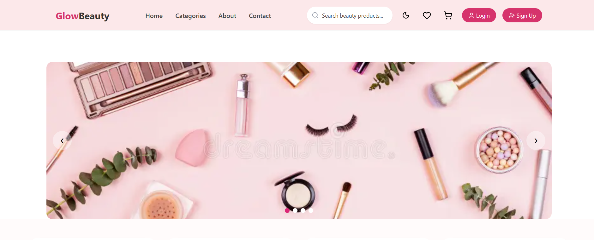
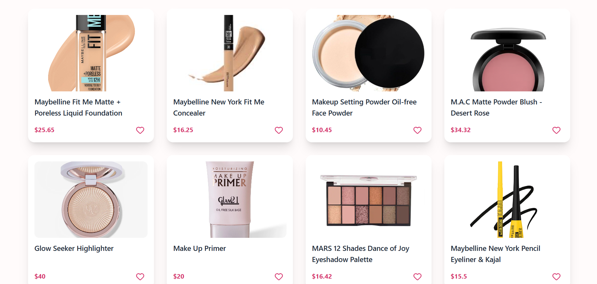
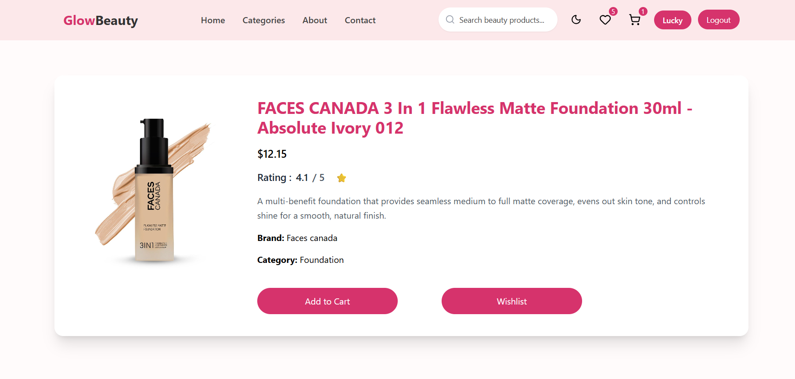
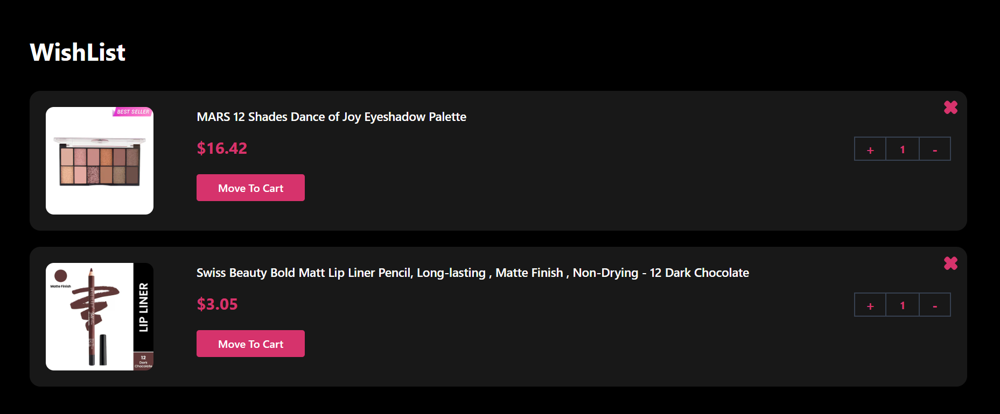
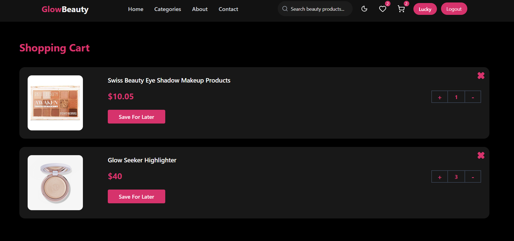
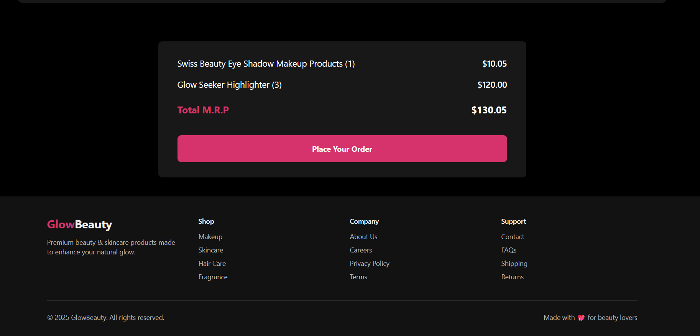

# Glow Beauty Website ✨

<p> <b> A mordern full-stack beauty & skincare E-commerce platform built with React, Django, Tailwind CSS  </b> </p>

## About the Project 

<p> Glow Beauty is a modern full-stack beauty & skincare e-commerce platform designed to deliver a smooth, stylish, and user-friendly online shopping experience. The website allows users to explore beauty and skincare products, view detailed product information, manage their shopping cart, and securely interact with the platform through authentication features. </p>

<p> The project focuses on building a responsive and visually appealing interface with dark mode support while implementing powerful backend functionality and dynamic API-based data handling. </p>

<p> This project helped me strengthen my full-stack development skills by combining frontend design, backend integration, authentication systems, and scalable project architecture. </p>


## 🚀 Key Features

- 🌙 Modern Dark Mode UI
- 🔐 Secure Authentication System
- 🛒 Dynamic Shopping Cart


## Tech Stack


## Screenshorts

<p align="center">
    
    
</p>

<p align="center">
    
    
</p>

<p align="center">
    
    
</p>


## ✨ Features

- 🔐 Authentication
- 🛒 Cart System
- ❤️ Wishlist
- 🌙 Dark 


## 📂 Folder Structure

```bash
E-Commerce-Project/
│
├── backend/
│
├── eCommerceProject/
│
├── images/
│
├── venv/
│
└── README.md
```

